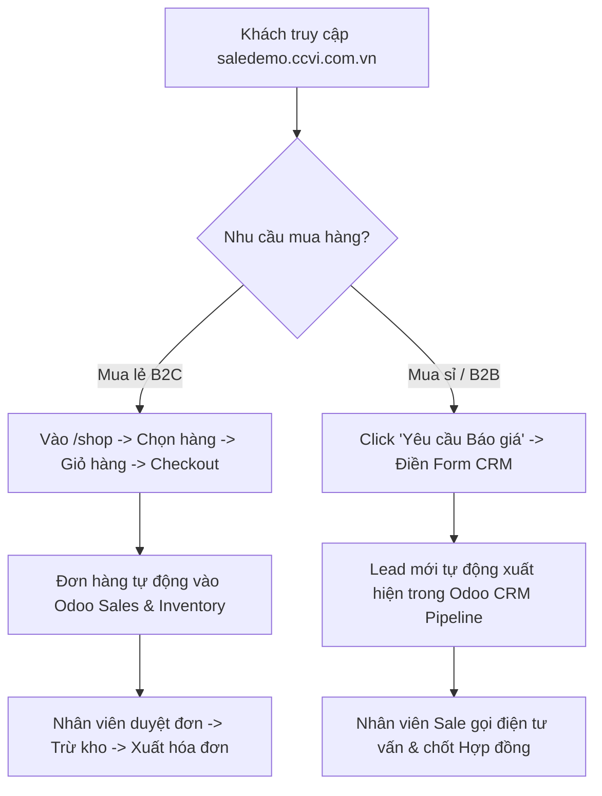

# WIREFRAME & UX ARCHITECTURE: SALE WEBSITE TEMPLATE

> **Mô hình**: E-Commerce + CRM + Order Fulfillment (Odoo 19)  
> **Domain**: `saledemo.ccvi.com.vn`  
> **Module Nguồn**: `sale_website_home`  

---

## 1. TỔNG QUAN KIẾN TRÚC WIREFRAME

Wireframe này được thiết kế tối ưu hóa theo tiêu chuẩn UX/UI E-Commerce hiện đại, chú trọng vào **Tỷ lệ chuyển đổi (Conversion Rate Optimization - CRO)** và **Hành trình trải nghiệm khách hàng (Customer Journey)**:

```text
+-----------------------------------------------------------------------------------+
| TOPBAR: Hotline | Email | Giờ làm việc                       | Language: VI / EN  |
+-----------------------------------------------------------------------------------+
| NAVBAR: [LOGO]  Trang chủ  Sản phẩm  Giới thiệu  Tin tức  Liên hệ | [🔍] [🛒2] [👤] [CTA] |
+-----------------------------------------------------------------------------------+
| HERO SECTION:                                                                     |
|   Headline: KẾT NỐI SẢN PHẨM & GIẢI PHÁP BÁN HÀNG                                 |
|   Subtext: Nền tảng thương mại & quản lý doanh nghiệp toàn diện.                  |
|   [Button: Khám phá sản phẩm]   [Button: Nhận tư vấn B2B]                          |
+-----------------------------------------------------------------------------------+
| CATEGORY GRID (8 Danh mục sản phẩm trực quan)                                     |
|  [Đồ uống]  [Thực phẩm]  [Thảo dược]  [Quà tặng]  [Nông sản]  [Đóng hộp] ...        |
+-----------------------------------------------------------------------------------+
| FEATURED PRODUCTS (Sản phẩm bán chạy & Báo giá nhanh)                            |
|  [Card 1: Ảnh + Giá + Nút Thêm giỏ]  [Card 2]  [Card 3]  [Card 4]                 |
+-----------------------------------------------------------------------------------+
| CORPORATE CREDIBILITY (Năng lực doanh nghiệp & Chứng nhận)                        |
|  - Tiêu chuẩn ISO / HACCP / FDA                                                   |
|  - Quy trình xuất khẩu & phân phối                                                |
+-----------------------------------------------------------------------------------+
| LEAD CAPTURE FORM (Form yêu cầu báo giá -> Tạo CRM Lead)                          |
|  [Tên Cty] [Họ tên*] [Email*] [SĐT] [Nội dung yêu cầu]   ---> [Gửi Báo Giá]       |
+-----------------------------------------------------------------------------------+
| FOOTER:                                                                           |
|  [Logo & About]   [Giới thiệu]   [Sản phẩm]   [Chính sách]   [Liên hệ & Social]   |
+-----------------------------------------------------------------------------------+
```

---

## 2. NGHỆ THUẬT THIẾT KẾ NAVIGATION MENU (FRONTEND NAVIGATION UX)

### 📌 2.1. Topbar (Thanh thông báo & Liên hệ nhanh)
- **Vị trí**: Nằm trên cùng của trang web, nền tối tương phản (`bg-dark`).
- **Nội dung**:
  - `Hotline`: Kích hoạt cuộc gọi trực tiếp khi bấm di động (`tel:`).
  - `Email`: Liên hệ kinh doanh khẩn cấp (`mailto:`).
  - `Giờ làm việc`: Giúp khách B2B biết khung giờ tư vấn.
  - `Chuyển đổi ngôn ngữ`: Selector nhanh cho thị trường Việt Nam & Quốc tế.

### 📌 2.2. Main Navbar (Thanh điều hướng chính - Sticky Navigation)
- **Hiệu ứng**: Cố định khi cuộn trang (`sticky-top`) giúp người dùng dễ dàng di chuyển bất kỳ lúc nào.
- **Brand Logo**: Nằm góc trái, click về trang chủ (`/`).
- **Danh sách Menu chính (5 mục tối giản)**:
  1. **Trang chủ** (`/`): Tổng quan thương hiệu và dịch vụ.
  2. **Sản phẩm** (`/shop`): Trang mua hàng E-commerce, lọc danh mục, tìm kiếm theo giá.
  3. **Giới thiệu** (`/about-us`): Hồ sơ năng lực doanh nghiệp, tầm nhìn, sứ mệnh.
  4. **Tin tức** (`/blog`): Bài viết chuyên ngành, kiến thức sản phẩm & cập nhật thị trường.
  5. **Liên hệ & Báo giá** (`/contactus`): Đơn yêu cầu tư vấn, bản đồ vị trí văn phòng.

### 📌 2.3. Cụm Action Bar (Góc phải Navbar - Tăng tương tác)
- **🔍 Search (Tìm kiếm nhanh)**: Trỏ trực tiếp đến tính năng tìm kiếm sản phẩm.
- **🛒 Giỏ hàng (Badge đếm số lượng)**: Hiển thị realtime số món hàng trong giỏ, nhấp vào dẫn đến trang checkout `/shop/cart`.
- **👤 Tài khoản người dùng**:
  - Khi chưa đăng nhập: Nút `Đăng nhập` dẫn đến `/web/login`.
  - Khi đã đăng nhập: Icon trang cá nhân dẫn tới Portal theo dõi đơn hàng `/my/home`.
- **🚀 Primary CTA Button**: Nút **"Yêu cầu Báo Giá"** nổi bật với màu thương hiệu (`btn-primary rounded-pill`), thu hút khách mua sỉ/bán buôn gửi yêu cầu ngay lập tức.

---

## 3. CẤU TRÚC CHI TIẾT TRANG CHỦ (HOMEPAGE SECTIONS)

### 3.1. Hero Banner Section
- **Tập trung**: Thông điệp chính, giá trị cốt lõi của doanh nghiệp.
- **CTA kép**:
  - Primary CTA: *Khám phá sản phẩm* (Dẫn tới `/shop`).
  - Secondary CTA: *Nhận tư vấn* (Cuộn mượt xuống form `#contact`).

### 3.2. Product Categories Grid
- Hiển thị 8 icon danh mục tiêu biểu dưới dạng lưới Responsive (8 cột trên Desktop, 2 cột trên Mobile).
- Giúp người dùng nắm bắt dải sản phẩm chỉ trong 2 giây đầu lướt web.

### 3.3. Corporate Credibility (Về chúng tôi & Năng lực)
- Hiển thị các chỉ số ấn tượng (Số năm kinh nghiệm, Số quốc gia xuất khẩu, Sản phẩm tiêu chuẩn).
- Tăng độ tin tưởng (Trust factor) cho khách mua sỉ và đối tác doanh nghiệp.

### 3.4. Lead Capture Form (Form thu thập khách hàng tự động)
- **Cơ chế**: Người dùng điền form ➔ Tự động gọi API Odoo `/sale/contact/submit` ➔ Khởi tạo 1 hồ sơ **Lead/Opportunity** trực tiếp trong App **Odoo CRM**.
- **Tính năng bảo vệ**: Tích hợp Honeypot chống Spam bot.

---

## 4. TỔNG KẾT LUỒNG TRẢI NGHIỆM KHÁCH HÀNG (CUSTOMER JOURNEY)


